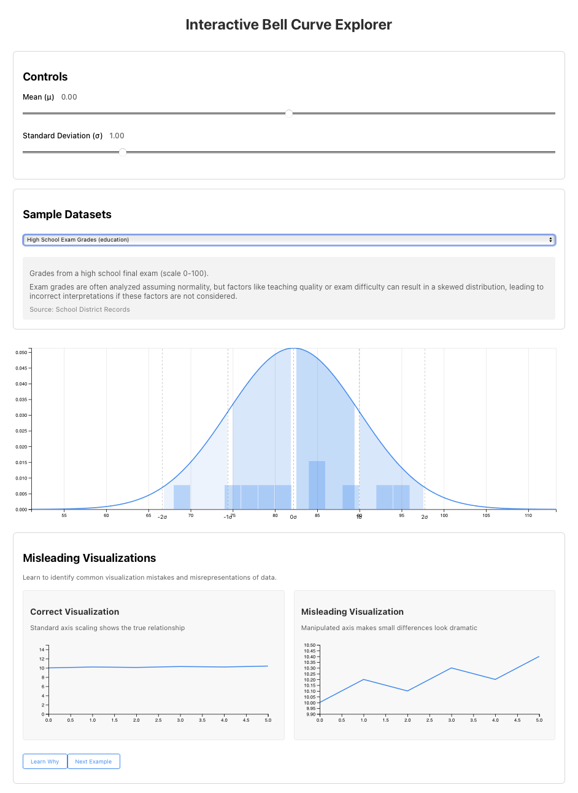

# Interactive Bell Curve Explorer

An interactive visualization tool for exploring and understanding normal distributions, statistical concepts, and common data visualization pitfalls.



This was created with ChatGPT 4o and Aider/Claude Sonnet 3.5. Prompts:

- In ChatGPT:
  - You are a professor of statistics at a major university, and a leading software engineer, and you have decided to build a truly great interactive visualization of the bell curve, complete with tooltips, explanations, and tons of sample data. Can you describe your ideal visualization, how it would work, and not only how it might lead to better statistical thinking, but how it might help people understand bad statistical thinking as well? (See [definition][./docs/definition.md]).
  - That's great. Could you please act as a senior data architect and engineer, and convert that into a detailed, structured document that details exactly how that system will work, with each component fully outlined with max/min values. It should have a level of detail appropriate that a group of junior engineers could build it. The end system should use the React framework, Typescript, modern libraries, and it should read a JSON file that describes sample data for the visualization across multiple industries, disciplines, and use cases, so define the schema for that as well with a few examples. ([Spec][./docs/spec.md])
  - Great. Could you please come up with about 20 different sample applications and put that into a valid JSON example. With each application include a full description and explanation of how the data can be used, along with any caveats or risks of applying statistical thinking to that field. In this fields, write in the tone of a smart, thoughtful professor of statistics who loves the field and is passionate about sharing it with their students.
  - You are a junior software engineer and have been handed this conversation and told to make it work. What is your plan of work? ([Plan][./docs/plan.md]) 
- In Aider, with Claude:
  - You are a highly skilled engineer. Carefully review the plan.md document and complete the first task. When done, show me your work, then indicate what the second task is and ask for approval to move forward.
  - *Then I repeated "What is the next step?" Over and over and over, occasionally pasting in bugs and asking for changes.*
  - Create a README.md file fully explaining the project and how it is built and architected, with full instructions for deployment. Document trade-offs.


## Features

- **Interactive Bell Curve Visualization**
  - Dynamic adjustment of mean and standard deviation
  - Real-time visualization updates
  - Zoom and pan capabilities
  - Standard deviation shading and markers
  - Interactive tooltips showing exact values and percentiles
  - Histogram overlay for real data

- **Sample Datasets**
  - Pre-loaded real-world examples from various fields
  - Automatic calculation of mean and standard deviation
  - Detailed explanations of statistical implications

- **Scenario Simulations**
  - Generate normal distributions
  - Add outliers to see their effects
  - Create bimodal distributions
  - Adjustable sample sizes

- **Misleading Visualizations**
  - Side-by-side comparisons of correct vs misleading visualizations
  - Interactive examples of common visualization pitfalls
  - Educational explanations of why certain practices are misleading

## Technology Stack

- React 18.2
- TypeScript 4.9
- D3.js 7.8
- Styled Components 6.1
- React Testing Library
- Jest

## Prerequisites

- Node.js 16.x or higher
- npm 8.x or higher

## Installation

1. Clone the repository:
```bash
git clone https://github.com/yourusername/bell-curve-explorer.git
cd bell-curve-explorer
```

2. Install dependencies:
```bash
npm install
```

3. Start the development server:
```bash
npm start
```

The application will be available at `http://localhost:3000`

## Project Structure

```
bell-curve-explorer/
├── public/
│   ├── index.html
│   └── samples.json       # Sample datasets
├── src/
│   ├── components/
│   │   ├── BellCurveVisualization.tsx
│   │   ├── ControlPanel.tsx
│   │   ├── SampleDataPanel.tsx
│   │   ├── ScenarioSimulation.tsx
│   │   ├── MisleadingVisualizations.tsx
│   │   └── MisleadingVisualizationChart.tsx
│   ├── __tests__/
│   │   └── components/    # Component tests
│   ├── App.tsx
│   └── index.tsx
└── package.json
```

## Architecture

The application follows a component-based architecture with React, emphasizing:

- **Separation of Concerns**: Each component handles a specific aspect of the visualization
- **Stateful Components**: App.tsx manages global state, while components maintain local state when needed
- **TypeScript**: Strong typing for improved maintainability and developer experience
- **D3.js Integration**: Direct DOM manipulation for visualizations while letting React handle the component lifecycle

### Key Components

1. **BellCurveVisualization**
   - Core visualization component using D3.js
   - Handles zoom, pan, and interactive features
   - ARIA-compliant for accessibility

2. **ControlPanel**
   - Manages user inputs for mean and standard deviation
   - Provides immediate feedback through controlled components

3. **SampleDataPanel**
   - Loads and displays sample datasets
   - Calculates statistics from real data
   - Updates visualization automatically

4. **ScenarioSimulation**
   - Generates different statistical scenarios
   - Uses Box-Muller transform for normal distribution

5. **MisleadingVisualizations**
   - Educational component showing visualization pitfalls
   - Side-by-side comparisons with explanations

## Testing

Run the test suite:

```bash
npm test
```

Tests cover:
- Component rendering
- User interactions
- Data transformations
- D3.js integration

## Deployment

1. Build the production bundle:
```bash
npm run build
```

2. Deploy to your preferred hosting service. For example, with Netlify:
```bash
netlify deploy
```

## Trade-offs and Considerations

1. **D3.js vs Pure React**
   - **Choice**: Using D3.js for visualizations instead of pure React
   - **Pro**: Better performance for complex visualizations
   - **Con**: More complex integration with React's virtual DOM

2. **Data Management**
   - **Choice**: Local state vs Redux
   - **Pro**: Simpler implementation for current scope
   - **Con**: May need refactoring for additional features

3. **Sample Data Loading**
   - **Choice**: Static JSON vs API
   - **Pro**: No backend required
   - **Con**: Limited dataset size

4. **Visualization Performance**
   - **Choice**: SVG vs Canvas
   - **Pro**: SVG provides better accessibility and interactivity
   - **Con**: Performance may degrade with large datasets

5. **Mobile Responsiveness**
   - **Choice**: Responsive design vs separate mobile layout
   - **Pro**: Single codebase for all devices
   - **Con**: Complex interactions may be less optimal on mobile

## Contributing

1. Fork the repository
2. Create a feature branch
3. Commit your changes
4. Push to the branch
5. Create a Pull Request

## License

MIT License - see LICENSE file for details

## Acknowledgments

- D3.js community for visualization examples
- React community for component patterns
- Statistical resources and datasets from various sources
